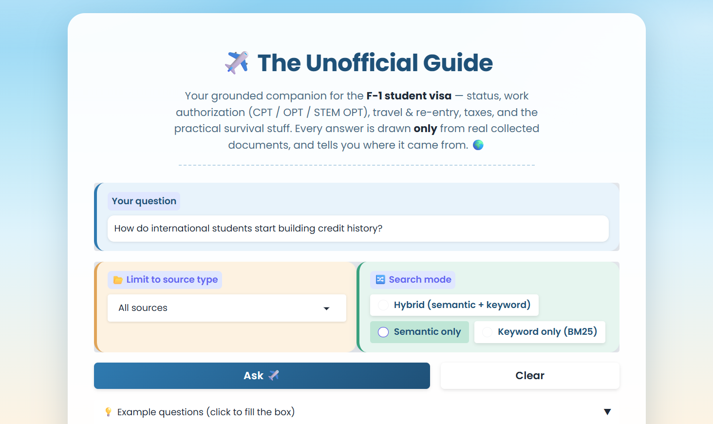

# The Unofficial Guide — Project 1

This is a question-answering system for international students on F-1 visas. You ask a plain question, like "can I work over winter break?" or "how many unemployment days do I get on OPT?", and you get an answer. The answer is built from a set of 53 real documents, and it tells you which ones it used.



**Stack:** `all-MiniLM-L6-v2` for local embeddings, then ChromaDB as the vector store (cosine distance), then Groq `llama-3.3-70b-versatile` for the actual answer, then a Gradio UI.

**Run it:**
```bash
pip install -r requirements.txt
# put GROQ_API_KEY=... in .env
python embed.py     # builds the ChromaDB index from chunks.jsonl (one-time)
python app.py       # launches the Gradio UI at http://localhost:7860
python run_eval.py  # reproduces the evaluation run below (one Groq call/question)

# Stretch-feature comparisons (both run fully local, zero Groq calls):
python hybrid_compare.py  # semantic vs BM25 vs hybrid on the 5 eval questions
python chunk_compare.py   # 3 chunk sizes compared on the same questions
```

---

## Domain

This system is about F-1 student visa stuff for international students in the US. That covers a lot: the visa application and interview, keeping your F-1 status, work authorization (on-campus jobs, CPT, OPT, and the STEM OPT extension), travel and re-entry, dependents, and the practical things like SSNs, credit history, and taxes.

This info is really useful, but it is genuinely hard to find. The problem is it lives in two worlds that never link to each other. The official rules are spread across government sites (DHS, USCIS, ICE, travel.state.gov) and a ton of separate university international-student-office pages. And they are written in dense legal language. The practical stuff is the opposite. Things like what actually happens at the port of entry, how long things really take, or which credit card to get when you have no SSN. That kind of thing lives on Reddit threads, YouTube walkthroughs, and student blogs. No official source ever points to it. So a student with one simple question has to dig through both worlds. This project puts the official sources and the student-shared stuff in one place you can search, and it gives you one answer pulled from both.

---

## Document Sources

There are 53 source documents total. That breaks down to 49 cleaned `.txt` files, 1 PDF, and a corpus summary. They cover seven subtopics and five source types: official government, university ISO guides, law firm guides, student blogs, Reddit, and YouTube transcripts. The full file-by-file list is in [document_inventory.csv](document_inventory.csv). Here are some of the sources:

| #  | Source | Type | URL or file path |
|----|--------|------|------------------|
| 1  | travel.state.gov — Student Visas | Official Gov | `documents/visa_application_travel_state_gov.txt.txt` |
| 2  | ICE / SEVIS — Working in the US (F-1 FAQ) | Official Gov | `documents/work_auth_ice_sevis.txt` |
| 3  | USCIS / DHS — Working while a student | Official Gov | `documents/work_auth_uscis.txt`, `documents/work_auth_dhs_working.txt` |
| 4  | Dartmouth ISO — Maintaining status, STEM OPT set | University ISO | `documents/maintaining_status_dartmouth.txt`, `documents/work_auth_dartmouth_stem_opt_*.txt` |
| 5  | UCSB / UW / UW-Madison / Northeastern ISO pages | University ISO | `documents/maintaining_status_ucsb.txt`, `documents/oncampus_jobs_uw.txt`, … |
| 6  | Buchalter & Jasmyn — status violations / reinstatement | Law firm | `documents/maintaining_status_buchalter_law.txt`, `documents/maintaining_status_jasmyn_law.txt` |
| 7  | InternationalStudent.com / InternationalStudentLoan.com guides | Student blog | `documents/work_auth_internationalstudent_working.txt`, `documents/work_auth_internationalstudentloan.txt` |
| 8  | StudentSucceed — OPT vs CPT plain-English guide | Student blog | `documents/work_auth_opt_vs_cpt_student_guide.txt` |
| 9  | r/f1visa & r/USCIS threads (re-entry, SSN/credit/tax tips, GC waits) | Reddit | `documents/reddit_tips_incoming_students.txt.txt`, `documents/reddit_leaving_us_advice.txt.txt`, +3 |
| 10 | University of Washington — Employment Options handout | University PDF | `documents/Employment-Options-Handout-Merged.pdf` |

---

## Chunking Strategy

**Chunk size:** about 800 characters, which is roughly 120 to 150 words.

**Overlap:** 150 characters, so about 19%.

**Why these choices fit the documents:** About 90% of the corpus is guide-style prose. You get a header, a paragraph, then some bullets, mostly from official and university sources. These documents tend to pack one full fact into a single paragraph. For example, "on-campus work is capped at 20 hours/week while school is in session, full-time during breaks." About 800 characters is roughly one solid paragraph. That is big enough to hold a complete answer with its context, but small enough that the chunk stays on one topic.

Going smaller (around 200 chars) breaks facts into useless bits. You end up with something like "…within 60 days" and you have no idea 60 days of what. Going bigger (around 2,000 chars) mixes several subtopics into one chunk and waters down the match. The 150-char overlap repeats the tail of each chunk at the start of the next one. So if a fact sits right on a boundary, it still shows up whole in at least one chunk.

I used one `RecursiveCharacterTextSplitter`-style splitter for the whole corpus. It splits on the biggest natural break first (`\n\n`, then `\n`, then sentence ends, then spaces) and only cuts mid-text as a last resort. During ingestion I also did some cleanup: I stripped out bracketed transcript markers (`[music]`, `[snorts]`) and fixed whitespace on the two YouTube transcripts, and I pulled the PDF text out with `pdfplumber`.

**Final chunk count: 599 chunks** across the 53 documents. Each one is tagged with four metadata fields: `source_file`, `source_name`, `category`, and `chunk_index`.

---

## Embedding Model

**Model used:** `all-MiniLM-L6-v2` through `sentence-transformers`. It runs locally, needs no API key, has no rate limits, is 384-dimensional, and is fast on CPU. That fits a corpus this size (about 56k words, 599 chunks) and a project that has to stick to free tools. The vectors go into a ChromaDB collection that saves to disk, set up with **cosine distance**. That matters because it makes the "on-topic results land under about 0.5" rule from the spec actually mean something. A strong match sits around 0.2 to 0.4, and weak or off-topic stuff drifts past 0.6.

**What I would do differently if cost was not a factor:**
- **Accuracy on domain-specific text:** MiniLM is a small, general model. A bigger one (`bge-large`, OpenAI `text-embedding-3-large`, or a Voyage domain model) would do a better job telling close immigration terms apart (CPT vs OPT vs STEM OPT). It probably would have avoided the Q4 retrieval miss below, by placing the credit-advice chunks closer to the query.
- **Context length:** MiniLM cuts off at 256 tokens. That is fine for chunks around 150 words, but a long-context model would let me use bigger chunks without re-chunking.
- **Multilingual support:** my users are international students. A multilingual model (`multilingual-e5`) would let someone search in their first language and still hit the English documents.
- **Local vs API, latency, cost, privacy:** local MiniLM costs nothing per query and keeps student data on the device. An API model trades that for better accuracy, but adds cost, latency, and a privacy question. For a real launch I would look at a mid-size local model like `bge-base` as the middle ground.

---

## Grounded Generation

**The grounding instruction in the system prompt.** The model gets a hard set of numbered rules (see `query.py`), not a polite hint. The main ones:

> 1. Answer using **ONLY** the information in the numbered context passages
>    provided in the user message. Do not use any outside or prior knowledge, even
>    if you are confident it is correct.
> 2. If the context passages do not contain enough information to answer, reply
>    with **exactly** this sentence and nothing else: *"I don't have enough
>    information on that."*
> 3. Do not guess, infer beyond what the passages state, or fill gaps with general
>    knowledge. **If the passages give a total but not a breakdown, give the total
>    and say the breakdown is not specified.**
> 4. Be concise and factual. Do not add a sources list yourself; sources are
>    attached separately by the system.

Some structural choices back this up:
- The retrieved chunks are the only domain content in the prompt. They are formatted as numbered, source-labeled `[Passage N]` blocks.
- Generation runs at **temperature 0**. So the same context gives the same answer every time, which makes the evaluation reproducible.
- Clause 3 is there on purpose to beat the model's strong habit of reciting the "90 + 60" OPT unemployment split. See Q5 below, where it works.

**How sources get shown.** Sources are built **in code** from the metadata of the retrieved chunks (`query.py`, in `generate()`). The model never gets to make them up. On a refusal the system attaches **no** sources, so it can never cite documents for an answer it didn't actually give. The Gradio UI also has a collapsible "retrieved passages" panel. It shows each chunk, its cosine distance, and its source, so you can check for yourself that the answer came from real context.

---

## Evaluation Report

I ran all five questions exactly as written in planning.md through `run_eval.py` (temperature 0, full output saved in `eval_output.txt`).

| # | Question | Expected answer | System response (summarized) | Retrieval quality | Response accuracy |
|---|----------|-----------------|------------------------------|-------------------|-------------------|
| 1 | Hours/week an F-1 student can work on campus while school is in session | Up to 20 hrs/week during the term; full-time during official breaks | "Up to 20 hours per week while school is in session." Cited ICE/SEVIS, UCSB, InternationalStudent.com, Dartmouth. | Relevant (top dist 0.176) | **Accurate** |
| 2 | Grace period after completing the program | 60 days to leave, transfer, or change status | "The 60-day grace period after graduation/post-completion OPT is to prepare to leave the US, unless beginning a new program of study." Cited ICE/SEVIS, Dartmouth, Buchalter. | Partially relevant (top-1 chunk was an off-topic on-campus-work passage at 0.282; the grace-period chunks ranked #2 to #5, 0.34 to 0.36) | **Accurate** (core 60-day fact correct; a little thin on the transfer/change-status options) |
| 3 | Requirements for the STEM OPT 24-month extension | STEM-designated degree, E-Verify employer, Form I-983 training plan | Listed all three plus valid F-1 status, post-completion OPT, and the previously-obtained-degree rules. Cited Dartmouth, StudentSucceed. | Relevant (top dist 0.269) | **Accurate** |
| 4 | What students recommend to start building credit history | Get an SSN, then open a credit card (Discover, or a no-SSN option like Zolve) and use it responsibly | **"I don't have enough information on that."** (refused) | **Off-target.** All top-5 chunks scored 0.589 to 0.598; the relevant Reddit chunks ranked #9 to #10 (0.61) | **Inaccurate** (failed to answer a question the corpus *can* answer, but it failed safe: it refused instead of making something up) |
| 5 | Total unemployment days across OPT + STEM OPT, and the split | 150 days total; the corpus does **not** state the breakdown | "150 days total for the entire OPT period, including both periods. The breakdown between regular OPT and STEM is **not specified**." Cited Dartmouth, StudentSucceed. | Relevant (top dist 0.323) | **Accurate**, and it refused to invent the common "90 + 60" split |

**Score: 4 of 5 accurate** (Q1, Q2, Q3, Q5), 1 inaccurate (Q4). Q5 was the grounding stress-test I designed, and the system passed it cleanly. It gave the 150-day total and said straight out that the split is unspecified, instead of reciting the "90 + 60" figure from its training data.

---

## Failure Case Analysis

Two different failures showed up, at two different stages of the pipeline. The first one (Q4) is the more interesting of the two, because it was a failure I did not plan for, on a question I thought would be easy.

### Primary failure — Q4 ("building credit history"): a retrieval miss

**Question that failed:** "What do students recommend doing to start building credit history as a new international student?"

**What the system returned:** *"I don't have enough information on that."* A refusal, with no sources.

**Root cause (retrieval stage, an embedding plus chunking thing).** The advice is in the corpus. `reddit_tips_incoming_students.txt.txt` flat-out recommends getting a Discover card or a no-SSN option like Zolve, and `reddit_leaving_us_advice` talks about credit cards and SSNs. But when I probed the index directly (`retrieve(query, k=50)`), those chunks only ranked **#9 and #10, at cosine distance about 0.61**. That is outside the `k=5` window, and also above my "about 0.5" on-topic threshold. The whole top-5 scored 0.589 to 0.598, all off-target. Two things stack up here:
1. **Diluted chunk embeddings.** The relevant Reddit posts are long "tips for incoming students" lists that jump between topics (gym, talking to seniors, SSN, credit cards, taxes, and so on). At an 800-char chunk size, the credit-card advice gets averaged in with everything else in that chunk. So the chunk's embedding ends up as a blurry average that does not sit near a focused "build credit history" query. This is exactly the "chunk covers several subtopics, so the match gets watered down" risk I called out in the Chunking Strategy section. It just bit a different question than I expected.
2. **A small, general embedding model plus a hard cutoff.** `all-MiniLM-L6-v2` does not strongly connect the casual phrase "building credit history" with the Reddit wording. So even when I reworded with keywords ("credit card with no SSN, Zolve, Discover"), the best Reddit chunk only came up to about 0.68. With nothing crossing a usable relevance bar, generation correctly refused. The grounding worked exactly as designed. The failure is all upstream, at retrieval.

**What I would change to fix it:** (a) chunk the Reddit and listicle documents more finely (or split on list-item boundaries) so one credit-card tip becomes its own focused chunk with a focused embedding; (b) raise `k` to about 8 to 10 so chunks at rank 9 and 10 reach the LLM; and/or (c) move to a stronger embedding model (`bge-base` or `bge-large`), which I already flagged in the production-tradeoff section as better at domain-specific matching. The cleanest single fix is (a), because it goes after the root cause (embedding dilution) instead of the symptom. I actually built and tested both fixes as stretch features below, and both pulled the credit source back into the top-5 (hybrid search took it from #9 to #1, and finer 400-char chunking did the same). See the Stretch Features section.

### Secondary failure — F1 ("J-1 hours / academic training"): an ingestion miss

**Question that failed:** "How many hours per week can a J-1 student work on campus, and what is academic training (AT) and its overall time limit?"

**What the system returned:** *"I don't have enough information on that."* Even though the University of Washington PDF handout literally has this in it.

**Root cause (ingestion / extraction stage).** `Employment-Options-Handout-Merged.pdf` is a **two-column comparison table** (F-1 vs J-1, and CPT vs OPT side by side). `pdfplumber` read the text straight across both columns, so it mixed a fact from the left column with a fact from the right column on every line. Here is what the retrieved chunk looks like:

> "On-Campus Employment Students may work 20 Students may work 20 hours/ hours/week
> while enrolled week while enrolled full-time, Examples include: RA/TA full-time,
> and more than 20 and more than 20 hours positions, library, IMA, hours between
> quarters and between quarters and during…"

Retrieval actually worked here. This chunk ranked #1 at distance 0.365. But the column-scrambled text is impossible to turn into a clean F-1-vs-J-1 answer, and the chunk with the "18-month overall limit" for AT didn't even make the top-5. Faced with context it couldn't parse, the model refused. So this failure is baked in at the ingestion stage. A text extractor that didn't understand the layout destroyed the table's structure before chunking or embedding ever ran.

**What I would change to fix it:** use a layout-aware or column-aware PDF extractor (like `pdfplumber`'s per-column bounding-box extraction, `camelot` or `tabula` for the table, or an OCR-layout tool) so each column gets read top to bottom as its own stream, then chunk each column on its own. Or, since it is just one short handout, I could just transcribe it to clean text by hand.

*(Side note: a third probe, F2, asked about the same CPT-limitation content the PDF covers, and the system answered it correctly. But it did that by pulling the clean InternationalStudent.com and InternationalStudentLoan.com sources. The scrambled PDF chunk never reached the top-5. So the corpus has enough overlap that the system could route around the bad PDF data for that question. That is why the PDF failure only shows up on content that is unique to the PDF, like the J-1 columns.)*

---

## Stretch Features

I added three. All three run fully local (MiniLM embeddings and BM25 on the CPU), so none of them spend a Groq call to build or test. That fit my budget rule: I could re-run every comparison below as many times as I wanted without burning API calls. Two of them go straight after the Q4 credit-history failure from the analysis above, from two different angles.

### 1. Hybrid Search (BM25 + semantic)

**What it does.** It adds a keyword search (BM25) over the same chunks and fuses it with the existing semantic search. The fusion is Reciprocal Rank Fusion (RRF): each method ranks the chunks, and a chunk's combined score is the sum of `1 / (60 + rank)` across both rankings. I used rank position instead of the raw scores because cosine distance (lower is better) and BM25 score (higher is better) live on totally different scales. RRF sidesteps that, so neither method can drown out the other. On top of plain RRF I pin each ranker's single best hit before filling the rest in fused order, so a landslide win in one method (BM25 nailing exact keywords the embedding misses) can't be buried by mediocre chunks that merely placed in both pools — without it, a chunk one ranker ranks #1 but the other never returns gets a single tiny RRF contribution and loses. (Code is in `embed.py`: `semantic_search`, `bm25_search`, `hybrid_search`. The UI exposes all three as a search-mode toggle — Hybrid (the default), Semantic only, and Keyword only (BM25) as a pure-keyword escape hatch.)

**Why it fits.** The words that matter for Q4, like "Zolve", "Discover", and "credit card", are sitting right there in the Reddit chunks. Semantic search missed them because MiniLM doesn't link the casual phrase "building credit history" to that wording. BM25 matches the exact keywords, so it catches what the embedding model couldn't.

**Results.** I ran semantic vs BM25 vs hybrid on all 5 eval questions and checked where the known-good source landed in each (script: `hybrid_compare.py`, no API calls). The number is the rank of the best correct source, and bold means it reached the top-5.

| Question | Semantic | BM25 | Hybrid |
|---|---|---|---|
| Q1 (on-campus hours) | **#1** | **#1** | **#1** |
| Q2 (grace period) | #11 | #8 | **#5** |
| Q3 (STEM OPT reqs) | **#1** | **#3** | **#2** |
| Q4 (credit history) | #9 | **#1** | **#1** |
| Q5 (unemployment days) | **#1** | **#1** | **#1** |
| **In top-5** | **3/5** | **4/5** | **5/5** |

Hybrid is the only one that gets all five questions into the top-5. It fixed Q4 (semantic #9, hybrid #1) and also quietly rescued Q2 (semantic #11, hybrid #5), which was the partially-relevant one from the eval. One detail I like: on Q4 the hybrid winners still have a bad cosine distance (~0.61), so semantic never would have trusted them. It was purely BM25 dragging the right Reddit chunks up through the rank fusion. So hybrid didn't just paper over the failure, it fixed it for the exact reason I predicted: the answer was keyword-findable even when it wasn't embedding-findable.

### 2. Metadata Filtering

**What it does.** A dropdown in the UI limits retrieval to one kind of source. So you can ask "what do the official rules say?" on its own, separate from "what do students say?". The groups are Official Government, University, Law firm, Student blog, Reddit, and YouTube, plus "All sources" for no filter.

**Why it fits.** My whole domain pitch is that this knowledge lives in two worlds, the official rules and the practical student take. This makes that split usable. A student who only trusts government sources can cut out Reddit and blogs and see only official answers, with the citations to back them up.

**How it works.** The chunks already carried a `category`, but not a clean source type, so I added a coarse `source_group` field to each chunk's metadata when building the index (derived from the `source_type` column in `document_inventory.csv`). ChromaDB has native `where` filtering, so semantic search passes the filter straight through. For BM25 and hybrid I filter the candidate chunks by the same field before ranking. Adding the field meant one local re-embed (`python embed.py --rebuild`), which costs no API calls.

### 3. Chunking Strategy Comparison

**What it does.** It re-chunks the whole corpus at three sizes, embeds each version into a throwaway in-memory index, and reports which one retrieves the right sources best. This actually tests the claim I made in the failure analysis, that chunking the Reddit listicles more finely would pull the Q4 credit source into the top-5, instead of just asserting it.

**How I judged it without the LLM.** I don't need answers for this, just retrieval. Each eval question has a known grounding source file, so for each config I checked, per question, whether a chunk from the expected source reached the top-5, plus the average top-1 distance. (Script: `chunk_compare.py`, in-memory index, no API calls and it never touches the real `chroma_db`.)

**Results.**

| Size / overlap | Chunks | In top-5 | Avg top-1 distance | Q4 rank |
|---|---|---|---|---|
| 400 / 75 (finer) | 1235 | **5/5** | **0.260** | **#1** |
| 800 / 150 (baseline) | 599 | 3/5 | 0.320 | #9 |
| 1500 / 200 (coarser) | 301 | 3/5 | 0.337 | #13 |

The finer 400/75 split won across the board. It got all five questions into the top-5, had the lowest average top-1 distance (closer matches), and pulled the Q4 credit source all the way from #9 up to #1. The coarser 1500/200 split was the worst and pushed Q4 even further down, to #13. This is exactly the pattern I predicted in the failure analysis: smaller chunks give the credit-card advice its own focused embedding instead of burying it in a long multi-topic Reddit post. So both fix (a) from my analysis (finer chunks) and the hybrid search above independently solve Q4, which is a nice confirmation that I had the root cause right.

I left the shipped index at 800/150 rather than switching to 400/75. The comparison only measures retrieval, not answer quality or prompt cost, and 400/75 more than doubles the chunk count, which means longer prompts and more tokens per Groq call. The honest takeaway is "finer chunking clearly helps retrieval here, and the cleaner production move is to chunk the Reddit listicles finely while leaving the well-behaved prose at 800," not "drop everything to 400."

---

## Spec Reflection

**One way the spec helped me while building.** Writing the Retrieval Approach section first, and committing to cosine distance and the "on-topic results under about 0.5" yardstick before I wrote any code, turned evaluation into something mechanical instead of a judgment call. When Q4 came back as a refusal, I didn't have to guess whether retrieval was the problem. I just re-ran `retrieve()` and saw the top-5 were all 0.589 to 0.598, every one above the 0.5 threshold I had already set. The spec gave me a number to measure against, so the root cause ("retrieval never found anything on-topic") was clear, and I could write it up precisely instead of vaguely. The deliberately-hard Q5 in the eval plan paid off the same way. Because I had written down exactly why it was hard (the docs only state the 150 total, not the 90+60 split), I knew to add an explicit anti-hallucination clause to the system prompt, and I knew what a "pass" looked like before I ran it.

**One way my implementation went off from the spec, and why.** The spec planned a single `ask()` function for generation. During Milestone 5 I split it into `retrieve()`, then `generate()`, then `ask()`, so the Gradio UI could run and show retrieval and generation as two separate steps (and show a "retrieved passages" panel). I did this because the spec only described the pipeline, not the interface. And surfacing the retrieved chunks turned out to be the single most convincing way to show grounding to a viewer. It makes the otherwise invisible retrieval step something you can audit. The original `ask()` still exists as a thin wrapper, so the change added a capability without breaking the planned contract.

---

## AI Usage

I used Claude (through Claude Code) as my main AI tool across the whole build. I checked each stage's output before building the next thing on top of it.

**Instance 1 — Embedding & retrieval (`embed.py`)**
- *Gave it:* the Retrieval Approach section of planning.md (MiniLM, top-k=5, ChromaDB, four metadata fields).
- *It produced:* a script that loads `chunks.jsonl`, embeds with MiniLM, stores vectors and metadata in a persistent ChromaDB collection, and exposes `retrieve(query, k=5)`.
- *I changed:* switched the collection to **cosine** distance instead of the default L2, so my "under about 0.5" threshold actually meant something. Also added a guard that skips re-embedding when all 599 chunks are already there.

**Instance 2 — Grounded generation (`query.py`)**
- *Gave it:* the grounding rule (answer only from context, fixed refusal phrase otherwise) and the output I wanted (answer plus cited `source_name`s).
- *It produced:* a first version that let the LLM write its own source list, with a soft "try to use the context" instruction.
- *I changed:* moved **source attribution into code** so the model can't invent or mis-cite a source (and a refusal returns zero sources), and rewrote the prompt into hard numbered rules with an exact refusal sentence. I added the "give the total, say the breakdown is not specified" clause that made Q5 pass instead of hallucinating the "90 + 60" split.

**Instance 3 — Evaluation & failure analysis**
- *Gave it:* run all 5 eval questions plus failure-case candidates targeting the multi-column PDF, keeping the Groq budget low.
- *It produced:* a batched `run_eval.py` (one call per question, saved to a file) and a guess that the PDF column-scramble would be the failure.
- *I changed:* the run surfaced a better failure, Q4 (credit history) refusing despite the answer being in the corpus. I steered the analysis into probing the index (`retrieve(..., k=50)`) to show the credit chunks ranked #9 to #10 at distance ~0.61, tying the failure to retrieval rather than generation. Kept the PDF case as secondary.
