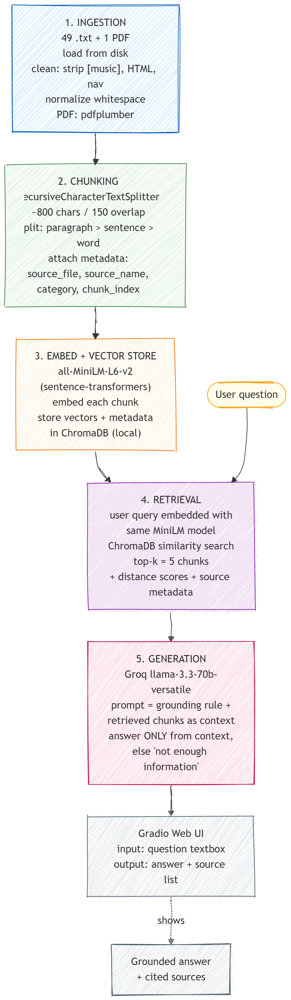

# Project 1 Planning: The Unofficial Guide

> Write this document before you write any pipeline code.
> Your spec and architecture diagram are what you'll use to direct AI tools (Claude, Copilot, etc.) to generate your implementation — the more specific they are, the more useful the generated code will be.
> Update the Retrieval Approach and Chunking Strategy sections if you change your approach during implementation.
> Update this file before starting any stretch features.

---

## Domain

This guide covers F-1 student visa stuff for international students in the US. That means the visa application and interview, keeping your F-1 status, work authorization (on-campus jobs, CPT, OPT, and the STEM OPT extension), travel and re-entry, dependents, and the practical survival stuff like SSNs, credit history, and taxes.

This knowledge is useful but it's a pain to find, because it lives in two separate places. The official rules are scattered across government sites (DHS, USCIS, ICE, travel.state.gov) and dozens of separate university international student office pages. They're written in dense legal language and they barely link to each other. The real, practical knowledge, like what actually happens at the port of entry, how long things really take, and what to do before you even arrive, lives on Reddit threads, YouTube walkthroughs, and student blogs that no official source points to. So a student with one simple question ("can I work over winter break?", "is my travel signature still valid?") has to dig through both worlds and figure out how they fit together. This project puts the official sources and the student-shared knowledge in one searchable, citable place. You ask a plain question and get a grounded answer that pulls from both.

---

## Documents

53 source documents in total: 49 cleaned `.txt` files, 1 PDF, and a corpus summary file. I collected and cleaned them all in Milestone 1. There's a full breakdown of every file (structure and cleanliness notes) in [`document_inventory.csv`](document_inventory.csv). The sources cover seven subtopics and five source types: official government, university ISO guides, law firm guides, student blogs, Reddit threads, and YouTube transcripts. That mix is on purpose, so I get both the official rules and the real student take on the same topics.

| # | Source (representative) | Subtopic covered | Type | Location |
|---|--------|-------------|-----------------|-----------------|
| 1 | travel.state.gov student visas | Visa application process, DS-160, fees, denials | Official Gov | `documents/visa_application_travel_state_gov.txt.txt` |
| 2 | InternationalStudent.com F-1 guide | Full visa process + interview question categories | Student blog | `documents/visa_application_internationalstudent_guide.txt` |
| 3 | Dartmouth, Northeastern ISO visa pages | University-specific visa application steps | University ISO | `documents/visa_application_dartmouth.txt`, `..._northeastern.txt` |
| 4 | Visa interview question/"never say" guides + YouTube | Interview prep, 2025/2026 question sets | Blog + YouTube | `documents/visa_interview_*.txt.txt`, `documents/youtube_visa_interview_2026.txt.txt` |
| 5 | DHS, UCSB, UT Dallas, UW, Colorado, Dartmouth | Maintaining status, enrollment, RCL, extensions | Gov + University | `documents/maintaining_status_*.txt` (11 files) |
| 6 | Buchalter & Jasmyn law firm guides | Status violations, reinstatement, consequences | Law firm | `documents/maintaining_status_buchalter_law.txt`, `..._jasmyn_law.txt` |
| 7 | ICE/SEVIS, USCIS, DHS working pages | Work authorization rules, on/off campus, FAQs | Official Gov | `documents/work_auth_ice_sevis.txt`, `..._uscis.txt`, `..._dhs_working.txt` |
| 8 | Dartmouth STEM OPT set (about/apply/types/reporting) | STEM OPT 24-mo extension end to end | University ISO | `documents/work_auth_dartmouth_stem_opt_*.txt` |
| 9 | Interstride, ISOA, Shorelight, UW | On-campus jobs: eligibility, finding jobs, types | Blog + University | `documents/oncampus_jobs_*.txt` |
| 10 | Georgetown, UCSF, USC, DHS, Dartmouth | Travel & re-entry, travel signatures, port of entry | Gov + University | `documents/travel_reentry_*.txt` |
| 11 | r/f1visa, r/USCIS threads (5) | Real re-entry experiences, SSN/credit/tax tips, GC waits | Reddit | `documents/reddit_*.txt.txt` |
| 12 | Employment Options Handout | Consolidated on-campus/CPT/OPT/STEM/hardship reference | University PDF | `documents/Employment-Options-Handout-Merged.pdf` |

---

## Chunking Strategy

**Chunk size:** about 800 characters (roughly 120 to 150 words)

**Overlap:** 150 characters

**Method:** I'm using one recursive character splitter (like LangChain's `RecursiveCharacterTextSplitter`) on every document. It splits on the biggest natural break first: paragraph breaks (`\n\n`), then single newlines, then sentence ends, then spaces. It only makes a hard cut mid-text if nothing else fits. This keeps chunks lined up with real idea breaks instead of chopping a sentence in half.

**Reasoning:**
- **One strategy for the whole corpus.** About 90% of my documents are guide-style prose (header, then paragraph, then bullets) from official and university sources. So a recursive paragraph and sentence splitter fits most of them right away. The few odd ones (2 YouTube transcripts, the JustAnswer Q&A, 5 Reddit threads) still split into decent chunks. One code path is way easier to build, debug, and explain for a first RAG. Doing different chunking per document type is something I noted as a possible stretch feature (the "Chunking Strategy Comparison" one), not part of the baseline.
- **Why about 800 characters?** My documents run about 400 to 1,500 words, and they usually pack one full fact into a paragraph (like "on-campus work is capped at 20 hours a week while school is in session, full-time during breaks"). 800 characters is roughly one solid paragraph. That's big enough to hold a complete answer with its context, but small enough that the chunk stays about one topic instead of blurring a few together. Go too small (around 200 chars) and facts break into useless fragments ("...within 60 days", 60 days of what?). Go too big (around 2,000 chars) and one chunk covers several subtopics, which waters down the match so specific questions don't land well.
- **Why 150-character overlap (about 19%)?** Facts in these guides often run across a break. A rule in one sentence, the exception in the next. Overlap repeats the tail end of each chunk at the start of the next one, so a fact that got split still shows up whole in at least one chunk. About 150 characters covers roughly the last sentence without stuffing the index with duplicate text.
- **How I'll know it's wrong:** if the chunks I print look like fragments or get cut mid-word, they're too small (or the overlap is off). If a chunk clearly covers 3+ unrelated topics, they're too big. I'll check by printing chunks in Milestone 3 and watching the retrieval distance scores in Milestone 4.

**Metadata stored with each chunk** (this is what powers source attribution, a required feature): `source_file` (like `maintaining_status_dartmouth.txt`), `source_name` (the readable version, like "Dartmouth ISO, Maintaining Status"), `category` (the subtopic, like `maintaining_status`), and `chunk_index` (where the chunk sits in its document). The citations in the UI show the readable `source_name`.

---

## Retrieval Approach

**Embedding model:** `all-MiniLM-L6-v2` via `sentence-transformers`. It runs locally, no API key, no rate limits. It makes 384-dimensional embeddings and it's fast on CPU. That's a good fit for a corpus this size (about 56k words, a few hundred chunks) and for a project that has to run on free tools.

**Top-k:** 5. With about 800-char chunks, 5 of them gives the LLM around 4,000 characters of context. That's enough to cover a fact plus some supporting detail, and to pull in a second source to back it up, without flooding the prompt with loosely related text that drags the answer off topic. I'll double-check k=5 against real results in Milestone 4 and drop to 3 or bump up to 6 if I need to.

**Why semantic search works here:** the embedding model turns text into vectors based on meaning, not exact words. So a question like "can I work over winter break?" can match a chunk that says "full-time employment is permitted during annual vacation periods", even with zero shared words. That matters here because students ask casually while the documents use formal, legal wording.

**Production tradeoff reflection (if cost weren't a constraint):**
- **Accuracy on domain-specific text:** `all-MiniLM-L6-v2` is a small, general model. A bigger one (like `bge-large`, OpenAI's `text-embedding-3-large`, or Voyage's domain models) would probably tell apart close immigration terms (CPT vs OPT vs STEM OPT) more cleanly.
- **Context length:** MiniLM cuts off at 256 tokens. That's fine for my roughly 150-word chunks, but if I moved to longer chunks I'd have to re-chunk. A long-context embedding model would remove that limit.
- **Multilingual support:** my users are international students, and some might search in their first language. A multilingual model (like `multilingual-e5`) would let non-English questions hit the English documents.
- **Local vs API, latency, cost:** local MiniLM means zero cost per query and no data leaving the machine, which is nice for a student-data product. The tradeoff is accuracy. An API model is more accurate but adds cost, latency, rate limits, and a privacy question. For a real launch I'd look at a mid-size local model (like `bge-base`) as the middle ground.

---

## Evaluation Plan

Five test questions, each with an answer I can actually check against a source document. Q1 to Q4 are well covered by clear sources. Q5 is a hard one on purpose: the answer is split across documents and easy to get half right, so it should expose a retrieval or grounding failure (the assignment hints that a good eval should surface a failure).

| # | Question | Expected answer | Grounding source(s) |
|---|----------|-----------------|---------------------|
| 1 | How many hours per week can an F-1 student work on campus while school is in session? | Up to 20 hours per week during the term. Full-time (more than 20 hrs) is allowed during official school breaks and annual vacation. | `work_auth_dhs_working.txt`, `maintaining_status_dartmouth.txt`, `work_auth_ice_sevis.txt` |
| 2 | What is the grace period for an F-1 student after they complete their program? | 60 days after the program end date (or the end of authorized OPT) to leave the US, transfer, or change status. | `maintaining_status_dartmouth.txt`, `maintaining_status_dhs.txt` |
| 3 | What are the requirements to qualify for the STEM OPT 24-month extension? | A degree in a DHS-designated STEM field, a job with an employer enrolled in E-Verify, and a completed Form I-983 training plan. Volunteer or unpaid work doesn't count. | `work_auth_dartmouth_stem_opt_about.txt`, `work_auth_dartmouth_stem_opt_types.txt` |
| 4 | What do students recommend doing to start building credit history as a new international student? | Get an SSN, then open a credit card to start building credit (students mention a Discover card, or a no-SSN option like Zolve), and use it responsibly without racking up debt. This is practical student advice, not an official rule. | `reddit_tips_incoming_students.txt.txt`, `reddit_leaving_us_advice.txt.txt` |
| 5 | **(Hard)** What is the total number of unemployment days allowed across regular OPT and the STEM OPT extension combined? | 150 days total of unemployment for the whole OPT period, counting both the initial post-completion OPT and the STEM OPT extension. | `work_auth_dartmouth_stem_opt_types.txt` (states the 150-day total) |

*Why Q5 is hard:* my documents only state the 150-day total. They don't spell out the common "90 days during initial OPT + 60 more during STEM" breakdown. So if someone asks how the 150 is split, a properly grounded system should give the 150 total and say it doesn't have the breakdown. If it instead answers "90 plus 60" it's pulling that from the model's general knowledge, not my docs, which is exactly the grounding failure I expect to catch and write up.

---

## Anticipated Challenges

1. **YouTube transcript junk makes for bad chunks.** The two transcript files (`youtube_*.txt.txt`) have stuff like `[music]`, `[snorts]`, filler words, and long run-on sentences with no paragraph breaks. If I don't clean them in Milestone 3, the splitter will make low-signal chunks (the junk adds noise to the embedding) and might cut in weird spots, since there are no `\n\n` breaks to split on. Fix: strip the bracketed markers and clean up the whitespace during ingestion, and check these files' chunks specifically.

2. **Sources disagree, and some are dated.** Immigration rules change, so sources contradict each other or go stale (for example, the USC and UCSF travel pages have late-2025 policy notes, and some pages came before those). Semantic search might pull an old chunk and a current one that read almost the same, and the LLM has no way to know which one is right. Fix: keep `source_name` and `category` in the metadata so the citation shows which source the answer came from, and flag conflicting-source questions as a known limit in the README.

3. **Facts split across chunk boundaries (the Q5 problem).** When the full answer needs numbers from two different documents (like the 90 days + 60 days = 150 days total), top-k might only grab one piece and give a half-right answer. Fix: overlap helps inside a single document. Across documents, a higher k or the eval itself will catch it, which is exactly what Q5 is testing.

---

## Architecture

The pipeline has five stages: Document Ingestion → Chunking → Embedding + Vector Store → Retrieval → Generation, each labeled with the tool it uses.

---

## AI Tool Plan

I'll use Claude (Claude Code) as my main AI tool. I'll check each stage's output before I build the next thing on top of it.

**Milestone 3 — Ingestion and chunking:**
- **What I'll give the AI:** the Documents section plus `document_inventory.csv` (so it knows the file types, the YouTube and Q&A cleanliness flags, and the PDF), the Chunking Strategy section (800 chars, 150 overlap, recursive splitter, metadata fields), and stages 1 and 2 of the architecture diagram.
- **What I expect it to produce:** a script that loads all the `.txt` files, pulls the PDF text with `pdfplumber`, cleans each document (strip `[music]` and other bracketed markers, fix the whitespace on the transcripts, drop any leftover junk), splits everything with `RecursiveCharacterTextSplitter` at my size and overlap, and tags each chunk with the four metadata fields.
- **How I'll check it:** print 5 sample chunks and the total chunk count (I expect somewhere around 50 to 500 for this corpus). I'll check the chunks make sense on their own, the YouTube files are cleaned up, and the metadata points to the right source file. If a chunk is a fragment or still has junk, I'll send it back with the exact example that failed.

**Milestone 4 — Embedding and retrieval:**
- **What I'll give the AI:** the Retrieval Approach section (MiniLM, top-k=5, ChromaDB plus metadata) and stages 3 and 4 of the diagram.
- **What I expect it to produce:** code that loads the chunks from M3, embeds them with `all-MiniLM-L6-v2`, stores the vectors plus metadata in a local ChromaDB collection, and a `retrieve(query, k=5)` function that returns the chunks, their distance scores, and the source metadata.
- **How I'll check it:** run 3 of my 5 eval questions through `retrieve()`, print the chunks and distances, and check the top results are on topic with distances under about 0.5. If retrieval is off, I'll debug it using the Milestone 4 checklist before I add generation. If there's a ChromaDB call I don't recognize, I'll ask Claude to explain it.

**Milestone 5 — Generation and interface:**
- **What I'll give the AI:** the grounding rule (answer only from the retrieved context, and say "I don't have enough information on that" when the context isn't enough), the output format I want (the answer plus a list of cited `source_name`s), and the Gradio skeleton from the instructions.
- **What I expect it to produce:** a prompt template that feeds the top-5 chunks in as context with a clear grounding instruction, a Groq `llama-3.3-70b-versatile` call that reads `GROQ_API_KEY` from `.env`, source attribution added in code (not left to the LLM to make up), and a Gradio UI that wires it all together.
- **How I'll check it:** make sure an out-of-scope question triggers the refusal, that in-scope answers cite real retrieved sources, and that no answer leans on the model's general knowledge. I'll read the generated system prompt to make sure grounding is actually enforced, not just suggested.
